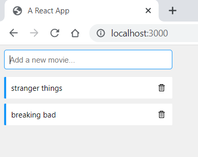

# Exemplo Docker Compose

Aplicativo de exemplo de Docker Compose

 * Front-end

 * Back-end

 * MongoDb

Executar o Docker Desktop na máquina

Docker Hub: https://hub.docker.com/

# Comandos 

> 
Veridicar a versão do docker compose

* 
docker-compose --version

> 
Executa o docker compose 

* docker-compose up
> 
Visualiza imagens

* 
docker images

> 
Login no Docker Hub

* 
docker login

> 
Publica no Docker Hub

* 
docker push fernandazaccarorigolin/app:v1

> 
verifica o log

* 
docker compose logs

# Imagem do aplicativo de exemplo

